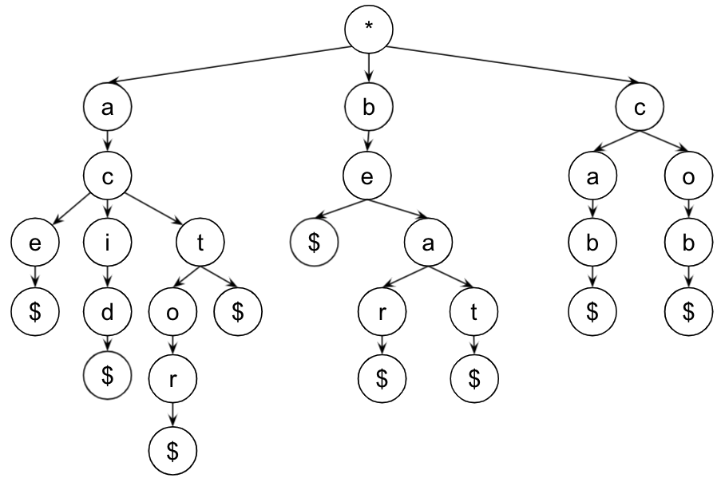

# HW5: Trees

The goal of this homework is to practice writing more involved algorithms on trees. This assignment is due **March 2, 2022 at 11:59pm**.

### Submitting & Grading
In order to submit this assignment, you must download your code as a ZIP file and upload it to Gradescope. Please include all files.

There are 18 points on this HW, but it will be graded out of 90% instead of 100%, so it is possible to get over 100%:
- Spellcheck Autograder (9 points)
- LeetCode (3 points)
- Documentation (4 points)
- Code Style (2 points)

For example, if you missed two points to receive a 16/18 = 88.9 / 100 instead of being out of 100, we will make it out of 90, so your final grade will be 88.9 / 90.0 = 98.8%. It is possible to get over 100%, but please see "Important Note About Final Grades" for more details on that front.

### Corrections
If you miss points on this assignment, there will be an opportunity to earn half back by doing homework corrections, so don't worry about the grade if you're having a tough time on some of the questions.

### Academic Integrity
Remember that you can consult outside resources and work with other students as long as you write up your own solutions and cite any links or people you received help from within `citations.txt`.

### Important Note About Final Grades
It is possible to get over 100% on the HW given how points are awarded. For the final grade in this course, the average in any one category (e.g. Homeworks) can only be as large as 100% (i.e. if you have a 105%, it will be a 100% for the final grade calculation). But, of course, getting above a 100% on this homework can help future or previous homeworks. This means that you should **not trust Canvas for your final grade, especially if your HW average is over 100%.**

## Spellcheck
We want to create a spellchecking program, where we keep a "dictionary" of words and look up whether certain spelling is valid. We also want to support a feature enabling users to add custom words to the dictionary.

We implement this functionality using a trie (pronunced "try"). A trie is a tree where each letter is a `char` and each path from the root to a leaf represents a valid word in the dictionary. See `TreeNode` definition in `TreeNode.h` and note that it is a general N-ary Tree (*not* a Binary Tree).



- This trie spells out "ace", "acid", "act”, “actor”, “be”, "beat", "bear", "cab”, "cob"
- To look up whether a word in the dictionary, we simply traverse the trie to see whether the word is in the trie; to add a word in the dictionary, we insert it into the trie. Although we won't implement it in this homework, you can imagine how tries can also be used to implement autocomplete functionality.
- Note that the value in the root of the tree should be ignored when making
  words.
- Note that an extra node with a "$" character denotes when a word has ended. This is necessary to know we've reached the end of the word, otherwise, we'd be unable to represent both "act" and "actor" as above without also accidentally representing "ac" and "acto".

All of the below should be implemented in HW5.cpp and you can see where it is tested in main.cpp's main. You may assume the input parameters are not `nullptr`s and only valid dictionary tries will be passed in.

### Q1. isValidWord (3 points)

This method is the crux of the spellchecking functionality. Given a word and a dictionary, `isValidWord` returns whether the word is in the dictionary.

For example, if `dict` is the example trie above,
```
std::cout << isValidWord(dict1, "ace") << std::endl;  // 1
std::cout << isValidWord(dict1, "ac") << std::endl;  // 0
std::cout << isValidWord(dict1, "actor") << std::endl;  // 1
std::cout << isValidWord(dict1, "actors") << std::endl;  // 0
```
Implement `isValidWord` in HW5.cpp.

### Q2. addWord (6 points)

This method adds a new word to the dictionary and returns whether the insertion actually happened. That is to say, if the word is already present, the method should return false and leave the trie unaltered.

Your trie should be "normalized," meaning that the added word should leverage the existing prefixes in the trie as much as possible. For example, adding "co" to the dictionary should not result in a complete separate branch, but rather only construct a '$' node under the existing '*' -> 'c' -> 'o' prefix.

Implement `addWord` in HW5.cpp.

Hint: You can add to a root’s vector of children by doing something like `root->getChildren().push_back(<WHATEVER_YOU_WANT_TO_ADD>)`.

## Q3. LeetCode: Diameter of Binary Tree (3 points)

Problem: [Diameter of Binary Tree](https://leetcode.com/problems/diameter-of-binary-tree/)

(Optional warm-up question that is slightly less difficult: Invert Binary Tree. If you complete it, you may submit to the [Google form]((https://docs.google.com/forms/d/e/1FAIpQLSfFvJjf3JmlwvMkiLDtr3LPJx2hh8zF3R6o6fUe3SnMx2RmnA/viewform)) for extra credit. Note: this is NOT the main question. All of the below refers to Diameter of Binary Tree)


**Q3.A** Provide one set of expected inputs and outputs that is not provided to be sure you understand the question in `Q3.txt`. You can draw your input tree as below (but please provide a different example).
```
      1
    /   \
   2     3
 /  \      \
8    7      5
```

**Q3.B** Describe your approach in words in `Q3.txt`. Then, solve the problem. After clicking "Submit" and getting status "Accepted", take a screenshot of the entire window (with the time submitted and your code). Attach the complete and successful screenshot as an image named `Q3.jpg` in your code submissions. Hints:
- We will want to use recursion as we did during class, but you should write a helper function which so you can pass other information between each function call. You may want to return both the max diameter calculated so far *and the height* of each node(e.g. as a `std::pair<int, int>` return type).
- Think about how the longest path that goes through any given root is related to the height of its two children.
- For any given root node, the diameter path could be one that goes through that root or one of the paths below it that does not. You'll want to take a max of those cases.

**Q3.C** What is the worst case time and space complexity of your approach? Please remember to define n, provide a tight upper bound, and justify your answer.

## Q4. Feedback (Not Graded)

Your responses to these questions will not affect your grade. They help improve or adjust homework assignments or lecture material in the future. 

**Q4.A** Approximately how much time (in hours) did you spend on this homework?
- <2 hours
- 2 - 4 hours
- 4 - 6 hours
- 6 - 8 hours
- 8 - 10 hours
- 10 - 12 hours
- \>12 hours

**Q4.B** Which problem was the most difficult? Any other thoughts?